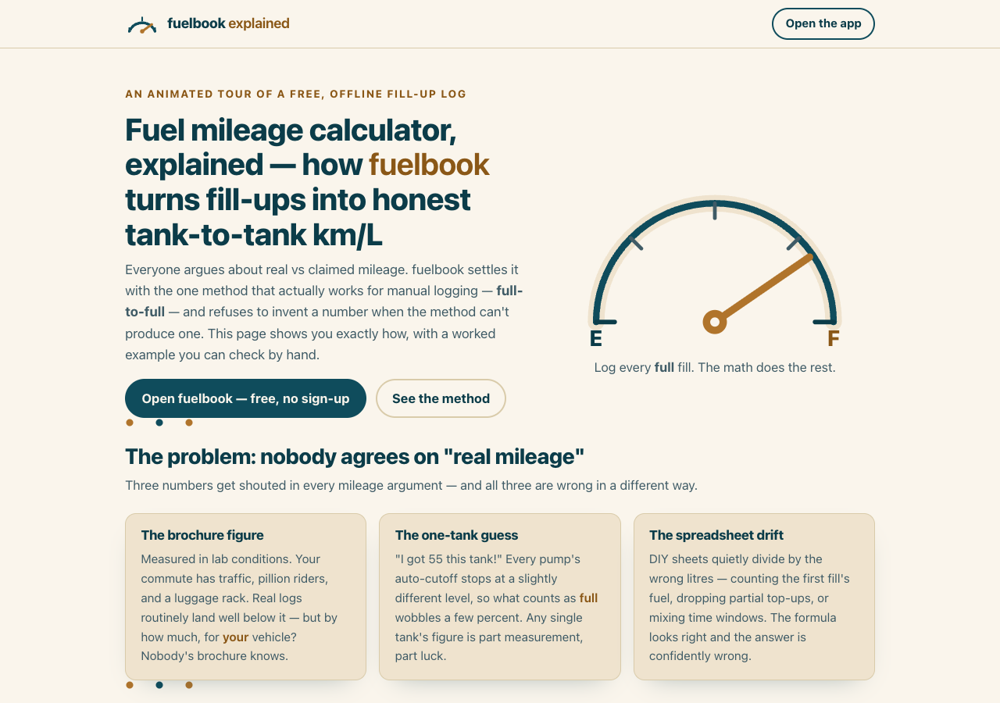

# fuelbook, explained — how honest fuel mileage math works

**An animated, single-page explainer of the full-to-full method behind
[fuelbook](https://sreenivas-sadhu-prabhakara.github.io/fuelbook/): honest tank-to-tank
km/L, true cost per km, and a privacy guarantee the browser itself enforces.**

Live page: **https://sreenivas-sadhu-prabhakara.github.io/fuelbook-explained/**
The app it explains: **https://sreenivas-sadhu-prabhakara.github.io/fuelbook/**



Everyone argues about real vs claimed mileage — brochure figures, one-tank guesses, and
spreadsheets that quietly divide by the wrong litres. This page walks through the one
method that actually works for manual logging, using a single hand-checkable worked
example, animated in pure CSS + inline SVG:

- **The full-to-full method** — a mileage segment runs between consecutive FULL fills;
  the animated timeline shows partial top-ups folding into the right segment and the
  trailing partial honestly excluded until the next full fill.
- **The trend** — one point per tank against a trailing-3-tank average, and the neutral
  prompt that fires when a tank dips more than 10% below it (a prompt, never a diagnosis).
- **True cost per km** — fuel-only vs all-in bars over the *same* first-FULL-to-last-FULL
  window, with out-of-window expenses flagged, never silently mixed in.
- **The privacy guarantee** — the app ships `connect-src 'none'` in its
  Content-Security-Policy, so the browser itself blocks every network send. The explainer
  animates the blocked packet — and ships the exact same CSP itself.

## Quickstart

Read it online at the link above, or run it locally:

```sh
git clone https://github.com/Sreenivas-Sadhu-Prabhakara/fuelbook-explained.git
cd fuelbook-explained
python3 -m http.server 8080   # or any static server
```

Then open `http://localhost:8080/`. To run the self-tests (Node 20+):

```sh
node --test
```

Every figure on the page is derived from `data/example.js` — the same module the tests
re-derive by hand (segment km/L to two decimals, cost per km in integer paise, the
trend-flag threshold, and a 500-round seeded property test that segments conserve km,
millilitres, and paise against the lifetime window). The page's JavaScript injects those
derived figures into the copy, so the prose can never silently drift from the math.

## How it's built

- Plain HTML + CSS + a small `app.js` — no framework, no build step, no dependencies.
- All animation is CSS keyframes on inline SVG, revealed by an IntersectionObserver.
  `prefers-reduced-motion` (and no-JS) get the fully-legible final states instead.
- Strict CSP with `connect-src 'none'`: no fonts, no CDNs, no analytics, no network.
- WCAG-AA in both light and dark schemes; keyboard-operable; skip-link; no serif fonts.

## Privacy

This page stores nothing, sends nothing, and asks for nothing. Its Content-Security-Policy
sets `connect-src 'none'`, so the browser blocks any network send — the same enforced
guarantee the fuelbook app makes about your fill-up log.

## Disclaimer

This page and the fuelbook app are informational calculators over numbers you enter
yourself — not financial, mechanical, or professional advice. All figures on this page
are a clearly-invented worked example (demo prices, demo vehicle). The software is
provided **"as is"**, without warranty of any kind — see [LICENSE](LICENSE). Verify
anything that matters with a professional.

## License

MIT © 2026 Sreenivas Sadhu Prabhakara
